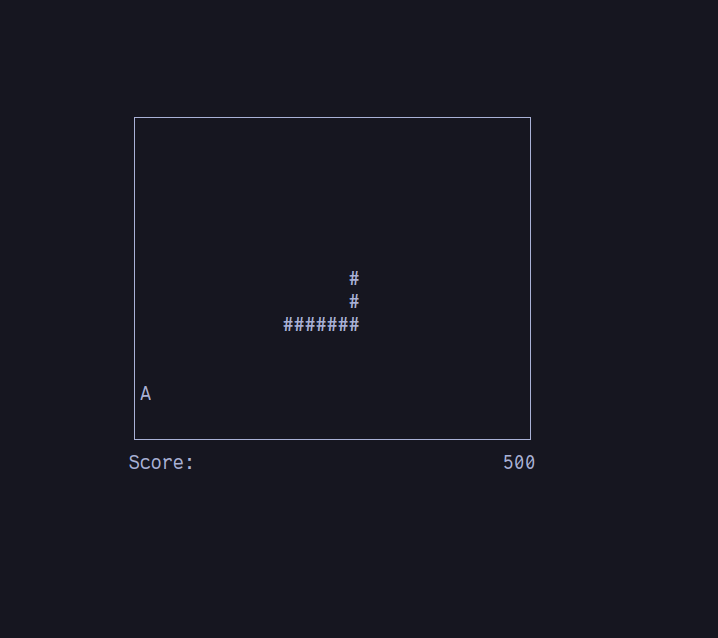

# Snake
Snake is a simple game build with help of [Ncurses](https://invisible-island.net/ncurses/announce.html).

Ncurses is a programming library providing an API that allows us to write text-based user interfaces in a terminal-independent manner. The package `libncurses5-dev` needs to be installed in order to use ncurses.

## Screenshot

## Code
Code is simple and easy to understand.

* [game.hpp](https://github.com/OPC-16/Snake-in-Ncurses/blob/main/headers/game.hpp) - contains the main logic, initializes the board, updates the state, processes the user-input, creation & destruction of 'apple', placing next snake piece.
* [board.hpp](https://github.com/OPC-16/Snake-in-Ncurses/blob/main/headers/board.hpp) - constructs centered board for snake, adding of chars and getting input from user.
* [scoreboard.hpp](https://github.com/OPC-16/Snake-in-Ncurses/blob/main/headers/scoreboard.hpp) - initialization, display and updation of scoreboard.
* [drawable.hpp](https://github.com/OPC-16/Snake-in-Ncurses/blob/main/headers/drawable.hpp) - implements class which can display anything on board having x, y & icon values.
* [apple.hpp](https://github.com/OPC-16/Snake-in-Ncurses/blob/main/headers/apple.hpp) - inherits drawable class and represents apple on board.
* [empty.hpp](https://github.com/OPC-16/Snake-in-Ncurses/blob/main/headers/empty.hpp) - inherits drawable class and represents an empty space on board.
* [snake.hpp](https://github.com/OPC-16/Snake-in-Ncurses/blob/main/headers/snake.hpp) - implements snake, its direction and gives position of next head of snake.

## Dockerfile
`Dockerfile` is a single stage build, while `Dockerfile.multistage` is a multi-stage build.\
Remember: to play the game we need to run the image interactively, i.e. `docker run -it <image-name>`
